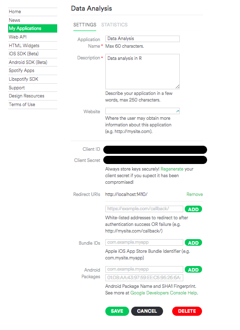

#### Setting Up Your Account
To be able to use the Web API, the first thing you will need is a Spotify user account (Premium or Free). To get one, simply sign up at [www.spotify.com](http://www.spotify.com/).

When you have a user account, go to the [My Applications](https://developer.spotify.com/my-applications) page at the Spotify Developer website and, if necessary, log in. Accept the latest [Developer Terms of Use](https://developer.spotify.com/developer-terms-of-use/) to complete the set-up of your account.

#### Registering Your Application
Any application can request data from Spotify Web API endpoints and many endpoints are open and will return data without requiring registration. However, if your application seeks access to a user’s personal data (profile, playlists, etc.) it must be registered. Registered applications also get other benefits, like higher rate limits at some endpoints.

You can register your application, even before you have created it. Follow these steps to register an application:

1. Go to the My Applications page at the Developer website.
2. Click **Create a new application**.
3. Enter the name of your application (for example, “My Test Application”.) Take note of this name, it will be used by your R program to connect to the API.
4. Enter an application description.
5. Click **Create**. The application details screen will open:

<center></center>

6. Add `http://localhost:1410/` as a Redirect URI.
7. Click Save to complete the registration of your application.
8. Your application will now be shown, along with any other applications you have registered, in the main list on the My Applications page.
9. Take note of the application name, client ID, and client secret, you'll need those to authenticate against the API before you start making calls.

To generate an authentication token for API access, run the below code once at the beginning of the R session.

```{r, eval=FALSE}
library(rspotify)
spotify::spotifyConnect(app_name, client_id, client_secret)
```
